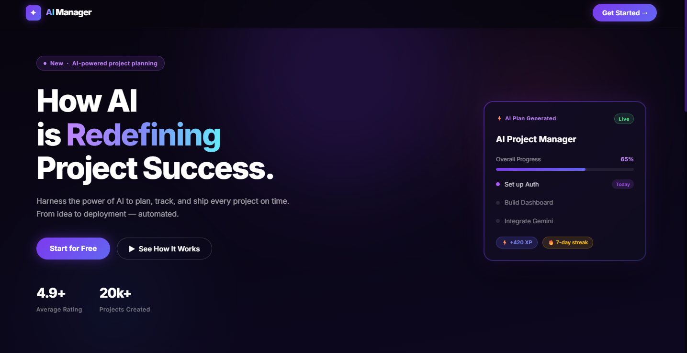
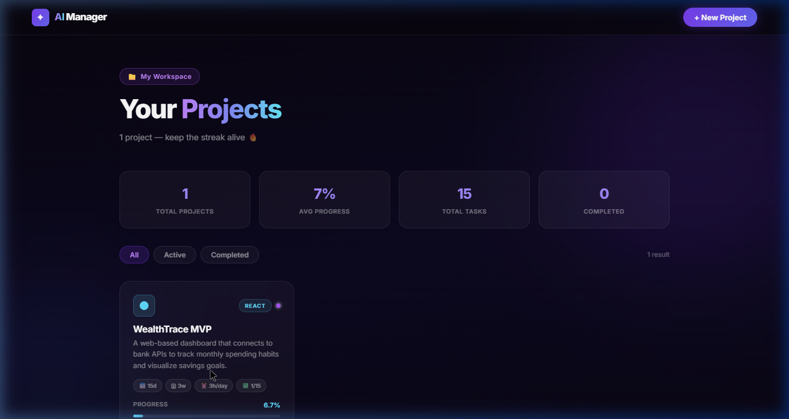
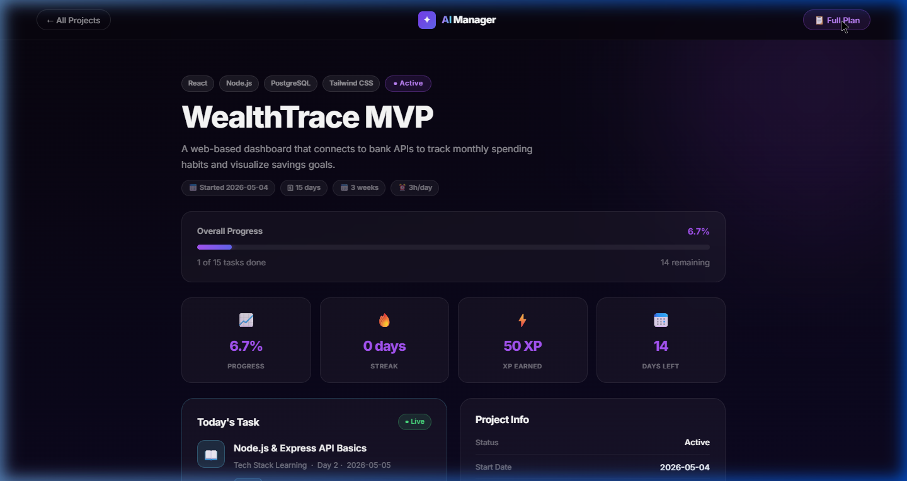
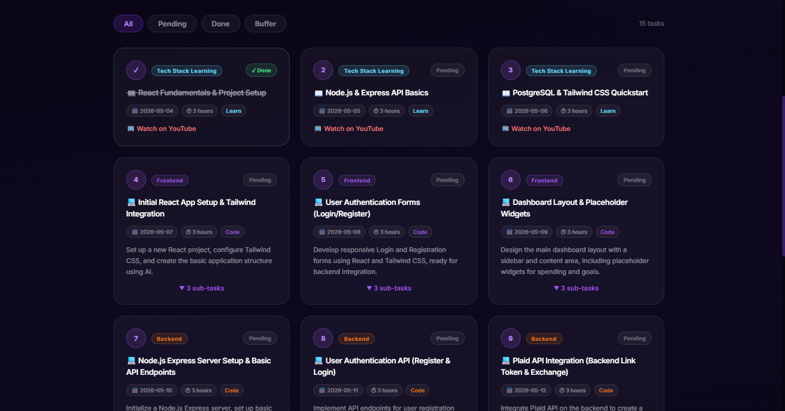

<div align="center">

<h1>🤖 AI Project Manager</h1>

<p><strong>Your personal AI-powered project planner that thinks, schedules, and follows up — so you don't have to.</strong></p>

<p>
  
  
  
  
</p>

</div>

---

## ✨ What It Does

AI Project Manager takes a project idea, breaks it into a day-by-day execution plan using **Gemini AI**, syncs it to **Google Calendar**, and sends you **daily task briefings via Gmail**. Reply `DONE` or `RESCHEDULE` to the email — the system updates your task status automatically.

No manual planning. No missed days. Just ship.

---

## 🖼️ Screenshots

### Landing Page


### Project Dashboard


### Project Detail View


### Full Plan Grid


---

## 🚀 Key Features

| Feature | Description |
|---|---|
| 🧠 **AI Planning** | Gemini 2.5 Flash generates a full day-by-day task plan from your project idea |
| 📅 **Google Calendar Sync** | Every task becomes a color-coded calendar event in your slot (morning/evening) |
| 📧 **Daily Email Briefings** | Task email sent 15 min before your slot — reply `DONE` or `RESCHEDULE` |
| ✅ **Email Reply Automation** | Inbox polled every 30 min — `DONE` marks task complete, `RESCHEDULE` moves it forward |
| 🗂️ **Project Dashboard** | Multi-project management with progress, streaks, XP, and completion stats |
| 🔄 **Auto-reschedule** | Missed tasks are automatically pushed to the next available date at 2 AM |
| 🗑️ **Cascade Delete** | Deleting a project removes tasks, email logs, and Google Calendar events |

---

## 🏗️ Tech Stack

```
Frontend   React 18 + Vite + Vanilla CSS (Dark Purple SaaS Theme)
Backend    FastAPI + APScheduler + SQLAlchemy + SQLite
AI         Google Gemini 2.5 Flash (via google-generativeai)
Email      Gmail API (OAuth2) — send + read replies
Calendar   Google Calendar API (OAuth2) — create/update/delete events
Auth       Google OAuth2 with token refresh
Deploy     Render (backend) + Vercel (frontend) + UptimeRobot (keep-alive)
```

---

## 📁 Project Structure

```
ai-project-manager/
├── backend/
│   ├── main.py              # FastAPI app + all API routes
│   ├── models.py            # SQLAlchemy models (Project, Task, EmailLog)
│   ├── schemas.py           # Pydantic request/response schemas
│   ├── database.py          # SQLite setup + migrations
│   ├── claude_planner.py    # Gemini AI plan generation
│   ├── gmail_service.py     # Send emails + poll replies
│   ├── calendar_service.py  # Google Calendar CRUD
│   ├── scheduler.py         # APScheduler background jobs
│   ├── reschedule.py        # Task rescheduling logic
│   └── prompts/             # AI prompt templates
├── frontend/
│   └── src/
│       ├── pages/
│       │   ├── LandingPage.jsx
│       │   ├── ProjectSetupPage.jsx
│       │   ├── ProjectListDashboard.jsx
│       │   ├── ProjectDetailDashboard.jsx
│       │   └── PlanReviewPage.jsx
│       └── api/client.js    # All API calls
├── render.yaml              # Render deployment config
└── docs/screenshots/        # README screenshots
```

---

## ⚡ Quick Start (Local)

### Prerequisites
- Python 3.10+
- Node.js 18+
- Google Cloud project with Gmail + Calendar APIs enabled
- Gemini API key from [Google AI Studio](https://aistudio.google.com)

### 1. Clone & Setup Backend

```bash
git clone https://github.com/YOUR_USERNAME/ai-project-manager.git
cd ai-project-manager/backend

python -m venv venv
venv\Scripts\activate          # Windows
pip install -r requirements.txt
```

### 2. Configure Environment

```bash
cp .env.example .env
# Edit .env and fill in:
#   GEMINI_API_KEY=AIzaSy...
#   YOUR_EMAIL=your@gmail.com
```

### 3. Google OAuth Setup

1. Go to [Google Cloud Console](https://console.cloud.google.com)
2. Enable **Gmail API** and **Google Calendar API**
3. Create OAuth 2.0 credentials → download as `backend/credentials.json`
4. Run the auth flow once to generate `token.json`:
   ```bash
   python -c "from gmail_service import get_gmail_service; get_gmail_service()"
   ```

### 4. Run Backend

```bash
uvicorn main:app --reload
# API at http://localhost:8000
# Swagger docs at http://localhost:8000/docs
```

### 5. Run Frontend

```bash
cd ../frontend
npm install
npm run dev
# App at http://localhost:5173
```

---

## 🔌 API Reference

| Method | Endpoint | Description |
|---|---|---|
| `POST` | `/api/plan` | Generate AI plan + save project & tasks |
| `GET` | `/api/projects` | List all projects with stats |
| `GET` | `/api/projects/{id}` | Project detail + today's task |
| `GET` | `/api/projects/{id}/plan` | Full task roadmap |
| `POST` | `/api/projects/{id}/sync-calendar` | Push tasks to Google Calendar |
| `POST` | `/api/tasks/{id}/complete` | Toggle task done/pending |
| `DELETE` | `/api/projects/{id}` | Delete project + cascade |
| `GET` | `/health` | Health check (UptimeRobot ping) |

---

## 🚀 Deploy (Free Stack)

| Service | What | Cost |
|---|---|---|
| [Render.com](https://render.com) | Backend + SQLite persistent disk | Free tier |
| [Vercel.com](https://vercel.com) | Frontend SPA | Free |
| [UptimeRobot.com](https://uptimerobot.com) | Ping `/health` every 5 min (keeps Render awake) | Free |

### Render Environment Variables

| Key | Value |
|---|---|
| `GEMINI_API_KEY` | Your Gemini API key |
| `YOUR_EMAIL` | Your Gmail address |
| `DB_PATH` | `/data/life_os.db` |
| `GOOGLE_TOKEN_PATH` | `/etc/secrets/token.json` |
| `ALLOWED_ORIGINS` | `https://your-app.vercel.app` |

> Upload your local `backend/google_auth/token.json` as a **Render Secret File** at path `/etc/secrets/token.json`.

---

## 🔒 Security Notes

- `credentials.json` and `token.json` are **never committed** (excluded by `.gitignore`)
- `.env` is excluded — use `.env.example` as a template
- The SQLite database (`*.db`) is excluded
- Remove `/api/debug/*` endpoints before production

---

## 📄 License

MIT — use freely, star if useful ⭐

---

<div align="center">
  <p>Built with ❤️ using Gemini AI, FastAPI, and React</p>
  <p>
    <a href="https://github.com/YOUR_USERNAME/ai-project-manager/issues">Report Bug</a> ·
    <a href="https://github.com/YOUR_USERNAME/ai-project-manager/issues">Request Feature</a>
  </p>
</div>
